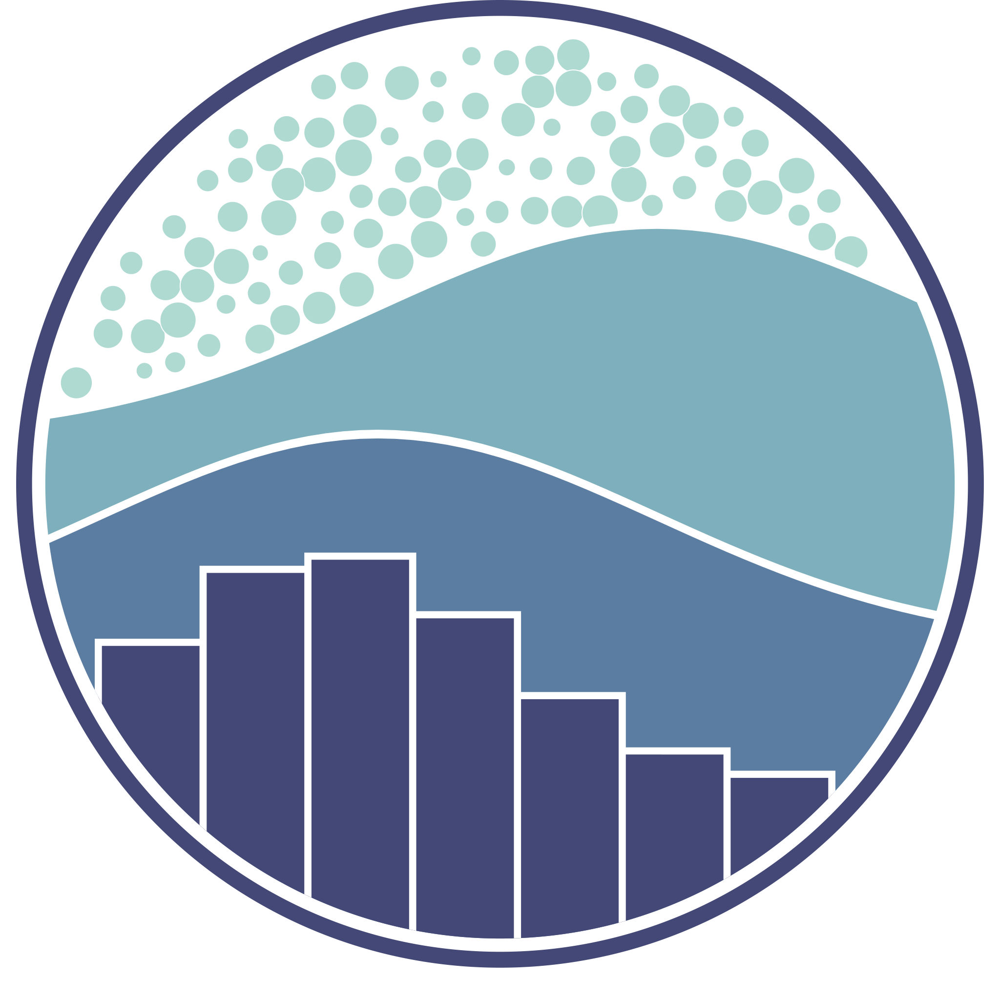

# Bem-vindo ao meu perfil no GitHub! 👋 Welcome to my GitHub profile!
 

# 👩🏻‍💻 Leandro Sousa

**`Desenvolvedor Full Stack Jr. baseado em Python`** / **`Python-based Jr. Full Stack Developer`**

 

## 🚀 Sobre mim /About Me

Sou um desenvolvedor em constante aprendizado sobre os temas programação, tecnologia e inovação. Focado em linguagem **Python** com abordagem em  **Ciência de Dados** e **Inteligência Artificial** . Estou aprofundando meus conhecimentos em **Desenvolvimento Web**, **Machine Learning** e **Deep Learning**, buscando criar soluções impactantes com o advento da IA.

 

## 👩‍💻 Formação e Estudos / Education and Studies
- 🎓 Cursando **Graduação em Sistemas de Informação** pela **Universidade UNIPROJEÇÃO**
- 🤖 **Desenvolvedor Python** (**SENAI**)
- 🧠 **Python Artificial Intelligence**  (**SENAI**)
- 💻 Estudando **Programação Full Stack (SENAI)**
- 🌱 Atualmente estudando Desenvolvimento Web Front-end e Administração de Banco de Dados

 

## 🔗 Vamos nos conectar / Let's connect

    
    
    
    
    
    
    

 

## 🔧 Habilidades e Tecnologias / Skills and Technologies

    
    
    
    
    
    
    
    
    
    
    
    
    
    
    
    
    
    
    
    
    
    
    
    
    
    
    
    
    
    
    
    
    
    
    
    
    
    
    
    
    
    
    

    

 

## 📊 Estatísticas / Statistics

    
  
    
  
    

 

 

## 📈 Gráfico de Atividade / Activity Graph

    

### 🎸 Um pouco do meu gosto musical / A little about my musical taste

  

### 👁️ Visualizações do perfil / Profile Views

