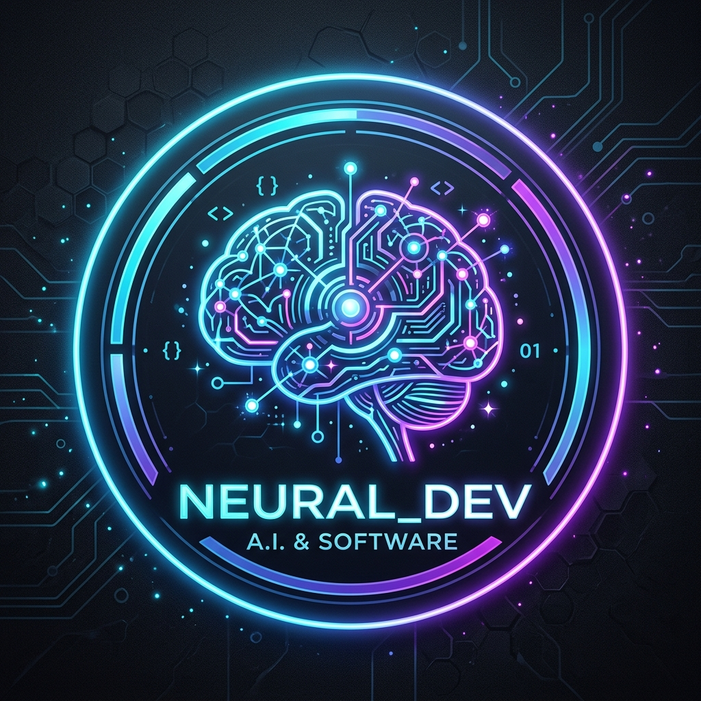

<!-- TOP BANNER -->

  

<!-- TYPING EFFECT GREETING -->

  

<!-- SOCIAL LINKS (ELEGANT FLOATING BADGES) -->

  
  &nbsp;
  
  &nbsp;
  
  &nbsp;
  
  &nbsp;
  
  &nbsp;
  
  &nbsp;
  

<!-- ABOUT ME & EDUCATION IN TWO COLUMNS -->
## 👤 Apresentação & Formação / About Me & Education

<table border="0" width="100%">
  <tr>
    <td width="30%" align="center" valign="top">
      
        
      <strong>Leandro Sousa de Jesus</strong> 
      📍 Brasília, DF, Brasil
    </td>
    <td width="70%" valign="top">
      <h3>🚀 Sobre mim</h3>
      

        Sou um desenvolvedor em constante aprendizado sobre temas de tecnologia, com foco especial na linguagem <strong>Python</strong> aplicada a <strong>Ciência de Dados</strong> e <strong>Inteligência Artificial</strong>. Atualmente, aprofundo meus conhecimentos em Desenvolvimento Web, Bancos de Dados, Machine Learning e Deep Learning, buscando criar soluções inovadoras impulsionadas por IA.
      

      <h3>🎓 Formação e Estudos</h3>
      <ul>
        <li>🎓 Cursando <strong>Graduação em Sistemas de Informação</strong> — <em>Universidade UNIPROJEÇÃO</em></li>
        <li>🤖 <strong>Desenvolvedor Python & IA</strong> — <em>SENAI</em></li>
        <li>💻 <strong>Programador Full Stack</strong> — <em>SENAI</em></li>
        <li>🔑 <strong>Administrador de Banco de Dados</strong> — <em>SENAI</em></li>
        <li>🌱 Atualmente focado em <strong>Front-end e Mobile com Java</strong> no Android Studio</li>
      </ul>
    </td>
  </tr>
</table>

## 🛠️ Tecnologias e Habilidades / Tech Stack

Aqui estão as ferramentas e tecnologias com as quais trabalho. Passe o mouse sobre os ícones para vê-los em ação! (Eles flutuam suavemente 🎈)

### 💻 Desenvolvimento Web & Back-End

   &nbsp;
   &nbsp;
   &nbsp;
   &nbsp;
   &nbsp;
   &nbsp;
   &nbsp;
   &nbsp;
   &nbsp;
   &nbsp;
   &nbsp;
  

### 🧠 Inteligência Artificial & Ciência de Dados

   &nbsp;
   &nbsp;
   &nbsp;
   &nbsp;
   &nbsp;
   &nbsp;
   &nbsp;
   &nbsp;
   &nbsp;
   &nbsp;
   &nbsp;
  

### 📱 Front-End & Mobile

   &nbsp;
   &nbsp;
   &nbsp;
   &nbsp;
   &nbsp;
  

### 🗄️ Banco de Dados & Infraestrutura Cloud

   &nbsp;
   &nbsp;
  

### ⚙️ Ferramentas, Testes & Outros

   &nbsp;
   &nbsp;
   &nbsp;
   &nbsp;
   &nbsp;
   &nbsp;
   &nbsp;
   &nbsp;
   &nbsp;
   &nbsp;
   &nbsp;
  

<!-- STATS SECTION -->
## 📊 Estatísticas / GitHub Stats

  <table border="0">
    <tr>
      <td align="center" valign="middle">
        
      </td>
      <td align="center" valign="middle">
        
      </td>
    </tr>
    <tr>
      <td align="center" colspan="2" valign="middle">
         
        
      </td>
    </tr>
  </table>

 

### 👁️ Visualizações do Perfil / Profile Views

  

 

  Desenvolvido com sofisticação e tecnologia de IA ✨

